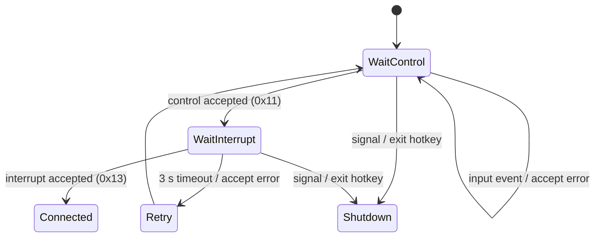
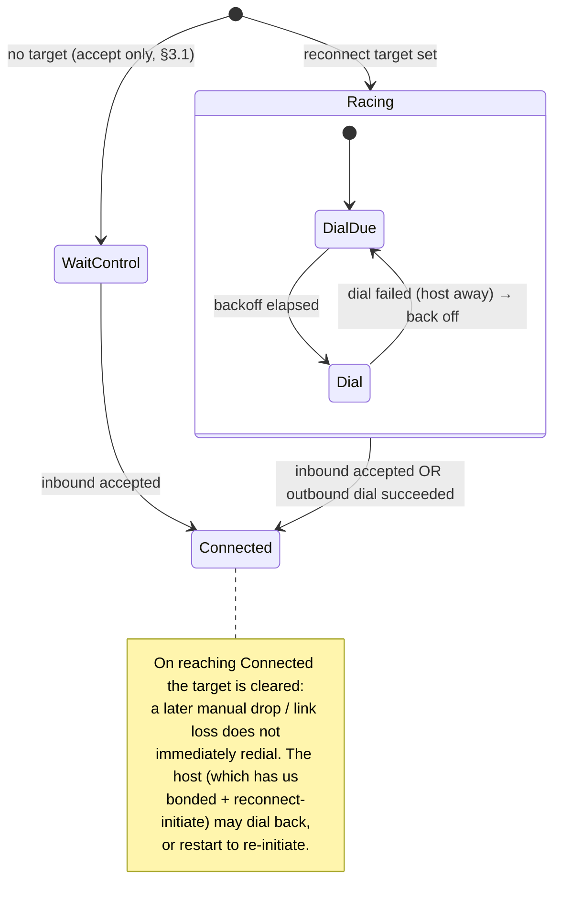
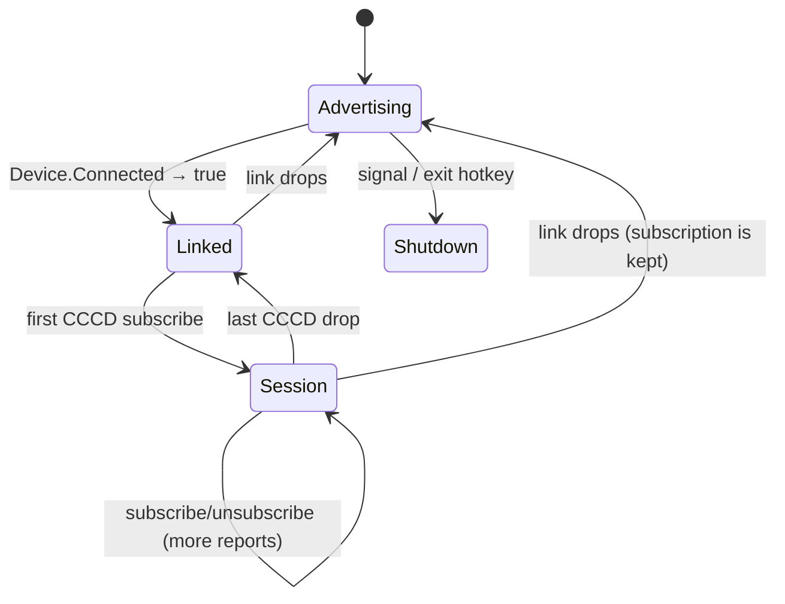
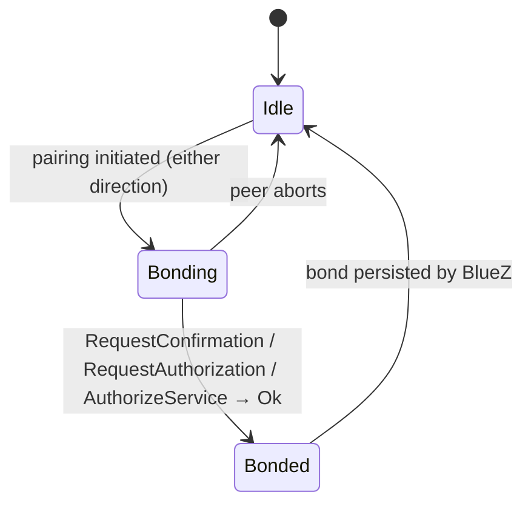

# Connection lifecycle & pairing

This document describes how blooter establishes, maintains and tears down a link
to a host, and where **pairing/agent handling** and **outgoing HID
(reconnect-initiate) connections** fit in. It complements the reference in
[design/ARCH.md](ARCH.md) (§4 transports, §9 lifecycle) and covers the two items
that were open in [TODO.md](../TODO.md).

Two guiding decisions shape everything below:

- **Config-first, inferred otherwise.** Behaviour is set in the config file
  where a setting makes sense; when a key is absent it is inferred from the
  runtime (chiefly: is stdin a TTY).
- **The menu is the starting point.** In interactive mode the host menu is the
  single entry point: the user picks a host, and blooter then does *whatever is
  needed to get a usable connection* — pair if necessary, then initiate the HID
  link.

## 1. The dimensions

Connection behaviour varies along three independent axes; the report pipeline
(design/ARCH.md §5, §7) is identical in every combination, so they all funnel
into one shared `Connected` state.

| Axis | Values | Chosen by |
|---|---|---|
| **Transport** | BLE (HOGP, the default) · Classic (BR/EDR HID) | `[connection] protocol` |
| **Role** | Acceptor (host dials us) · Initiator (we dial a known host) | whether a reconnect target is set |
| **Mode** | Interactive (stdin is a TTY) · Non-interactive | `isatty`, `-n` |

Two config keys drive the new behaviour:

- **`[connection] pairing`** — `"accept"` (accept silently, Just Works; the
  default), `"prompt"` (always prompt on the TTY — a startup error when stdin is
  not a TTY) or `"prompt_if_possible"` (prompt when stdin is a TTY, else accept).
- **`[connection] reconnect`** — a host address (`"AA:BB:CC:DD:EE:FF"`) to
  initiate an outgoing HID connection to. Absent → no configured target; in
  interactive mode the menu supplies one at runtime.

## 2. Shared lifecycle (transport-agnostic)

`main::main_loop` is one state machine regardless of transport. `wait_connected`
establishes a link; `run_session` forwards reports until the link drops, a
hotkey fires, or a signal arrives.

```mermaid
stateDiagram-v2
    [*] --> Setup
    Setup --> Accepting: transport registered / bound

    state Accepting {
        [*] --> WaitLink
        WaitLink --> WaitLink: input event (track state, honour exit hotkey)
    }

    Accepting --> Connected: link established (Accept::Connected)
    Accepting --> Accepting: transient failure (Accept::Retry)

    state Connected {
        [*] --> Forwarding
        Forwarding --> Forwarding: input event → HID report
    }

    Connected --> Cooldown: host disconnect / drop-connection hotkey
    Cooldown --> Accepting: RECONNECT_DELAY (0.5 s)

    Accepting --> [*]: SIGTERM / SIGHUP / exit hotkey
    Connected --> [*]: SIGTERM / SIGHUP / exit hotkey
    note right of Connected
        SIGINT is ignored while Connected
        (the keystroke may be for the host).
    end note
```

Transitions map to existing types (`transport/mod.rs`): `Accept::Connected` →
`Connected`; `Accept::Retry` → re-enter `Accepting`; `Accept::Shutdown` →
terminate. `Flow::Continue` → `Cooldown`; `Flow::Shutdown` → terminate. On
entering `Connected`, blooter resets per-session state, drains stale input, takes
the `-x` grab, and calls `on_connected` (design/ARCH.md §6.3); on leaving it
releases the grab.

The Role axis refines only the **`Accepting`** box (§3.2); pairing (§5) is a
**parallel concern** that BlueZ can raise in any state.

## 3. Classic link establishment

### 3.1 Acceptor path

Classic waits for the host to dial the control PSM (0x11), then the interrupt PSM
(0x13) within 3 s (`transport/classic.rs`).



### 3.2 Initiator path — reconnect-initiate

The SDP record advertises `HIDReconnectInitiate = true` (design/ARCH.md §3.1);
this path makes it real. When a **reconnect target** is set (from the menu or
`[connection] reconnect`), `wait_connected` races an outbound HID dial against
the inbound accept, so blooter can bring the link up itself.



Outbound dial mechanics (mirrors the inbound pair in reverse):

1. `SeqPacket::connect(SocketAddr(target, BrEdr, 0x11))` — control.
2. `SeqPacket::connect(SocketAddr(target, BrEdr, 0x13))` — interrupt.
3. Hand both sockets to the unchanged `run_session`, exactly as an accepted pair.

Resolved design points:

- **Bonded targets only; never self-pair.** A target is used only if it is
  *already* bonded (checked when the target is resolved, §6). blooter never
  calls `Device::pair()` itself: an outgoing pair racing the host's incoming
  pair makes BlueZ cancel authentication (`ECONNREFUSED` on the HID PSMs of an
  unready host). Bonding a *new* host is therefore always driven by that host's
  incoming connection plus our agent (§5); reconnect-initiate only re-links a
  host blooter already knows.
- **Race, don't serialise.** `select!` the inbound `accept()` against the
  outbound dial; whichever completes first wins, the loser is cancelled.
- **Backoff.** A failed dial (host asleep/out of range) backs off exponentially
  (1 s → 30 s cap) while still accepting inbound, so it never busy-loops.
- **One-shot per link.** The target is cleared once a link is up (either
  direction), so intentional drops and link loss don't trigger an immediate
  redial. Reconnection after that is the host's job (it has us bonded and sees
  `HIDReconnectInitiate`), matching the acceptor default.
- **Classic only.** See §4.

## 4. BLE link establishment

BLE has no accept syscall: the host connects at the GATT layer and blooter is
"connected" once it holds *both* a link and a subscription to any Report
characteristic's CCCD, disconnected when either goes (`transport/le.rs`,
design/ARCH.md §4.2).



**The subscription is not the link, and tracking only it was a real bug.** A
CCCD subscription looks like the natural connectedness signal, but it does not
end when the link does: bluetoothd calls `StopNotify` on a CCCD write of zero,
or when it tears down the CCC state of a device that went away — and for a
*bonded* device it deliberately does neither, keeping the subscription across the
disconnect and restoring it on the next connection (`att_disconnected` in bluez's
`src/gatt-database.c` returns before `clear_ccc_state`; the same restoration §7.2b
relies on). HOGP links are always bonded, so a host that just goes away — sleeps,
or walks out of range — used to leave blooter in `run_session` forever, neither
re-advertising nor re-opening the menu. `Le::watch_links` supplies the link half
of the edge from `Device.Connected`; keeping the notifiers registered meanwhile
matches what bluetoothd does with the CCC state, since a reconnecting host is
under no obligation to re-write a CCCD it knows is persisted.

**There is no initiator path, and there must not be one.** This is the one place
where BLE is not a mirror of Classic, and the asymmetry is structural rather
than a gap:

- **HOGP fixes the roles.** The HID Device is the GAP **Peripheral** and GATT
  Server; the HID Host is the **Central** and GATT Client. Only a central opens
  a link. If blooter dials out it *becomes* the central, and a host will not run
  its HOGP client over a link where it is the peripheral — so even a connection
  that succeeds is useless.
- **BlueZ picks the bearer, not us.** `Device1.Connect()` takes no transport
  argument; `dev_connect` in `device.c` chooses via `select_conn_bearer`, and for
  a dual-mode host object (any laptop) it prefers BR/EDR. It then finds no
  connectable BR/EDR profile and fails with `br-connection-unknown` — a *Classic*
  error raised on what was meant to be an LE operation. Forcing the bearer needs
  `Adapter1.ConnectDevice`, which is BlueZ-experimental and does not fix the role
  problem anyway.
- **Advertising is the reconnect mechanism.** A connectable advertisement is
  blooter's entire half of getting a link back: a bonded central reconnects to it
  by itself when it reappears. There is nothing to race, back off, or clear.

So `wait_connected` waits on the CCCD subscribe with no dial beside it, and
`[connection] reconnect` is **Classic-only** — set on BLE it is warned about at
startup and ignored. Pairing is likewise the host's to start (§5): blooter never
calls `Device::pair()` on BLE, which is the same "never self-pair" rule §3.2
states for Classic, applied where it matters more.

### 4.1 Device identity: `[ble] advertise`

The name and appearance in the LE advertisement only reach a host *before* it
connects. Once connected the host reads the **GAP service (0x1800)**, which
bluetoothd owns and builds itself:

- **Device Name (0x2A00)** comes from `btd_adapter_get_name` → the adapter's
  stored **alias**, falling back to the system hostname.
- **Appearance (0x2A01)** is derived from the adapter's **Class of Device**
  (`gap_appearance_read_cb`: `appearance[0] = class & 0xff`,
  `appearance[1] = (class >> 8) & 0x1f`).

Neither is the advertisement, so leaving them alone makes a host show the
machine's hostname and its computer icon no matter what blooter advertises.
`setup.rs` therefore runs on BLE too, and how far it goes is
`[ble] advertise`:

| Value | Alias | Class of Device | BR/EDR discoverable | On a class failure |
|---|---|---|---|---|
| `"auto"` (default) | yes | yes | unchanged | carry on, note at `debug` |
| `"alias"` | yes | no | unchanged | n/a |
| `"alias_cod"` | yes | yes | unchanged | **startup error** |
| `"alias_cod_hide"` | yes | yes | turned off | **startup error** |

The alias is a D-Bus property and needs no privilege; the class goes through the
management socket and needs `CAP_NET_ADMIN`, which is the whole reason `auto`
exists. Both are restored on exit — an alias that was never set is cleared
(BlueZ treats `""` as "back to the system name") rather than having the hostname
written back as an alias, which would pin it.

Two limits worth recording so they are not rediscovered:

- BlueZ's CoD → Appearance mapping is lossy. Class `0x000540` reads back as
  appearance `0x0540`, not the SIG Keyboard value `0x03C1`, and there is no
  D-Bus way to set GAP Appearance directly. The advertisement carries the correct
  `0x03C1` for pre-connection icons (design/ARCH.md §4.2).
- BlueZ has no per-transport discoverable flag, so `alias_cod_hide` hides the
  BR/EDR identity only — the LE advertisement is its own channel and stays up.

## 5. Pairing / agent handling

A single shared BlueZ **agent** is registered in `main::run` for **both**
transports (previously only BLE had one; Classic had none, so an incoming pair
could stall). It is registered as the default agent, and the adapter is set
pairable. Its behaviour follows `[connection] pairing` (§1).

**The IO capability is what decides the association model, and it is a side
effect of which callbacks the agent sets.** bluer derives it in
`Agent::capability()` — there is no field to declare it — so the callback set of
each agent in `agent.rs` is load-bearing, and adding a handler to one silently
changes how every host pairs:

| Callbacks set | Capability | What a host may then choose |
|---|---|---|
| none | `NoInputNoOutput` | Just Works only |
| confirm / authorize | `DisplayYesNo` | numeric comparison, **or passkey entry** |
| all of them | `KeyboardDisplay` | any model |

The second row is the trap, and the first row is a worse one. **An unset callback
is a rejection, not a default.** bluer documents an all-`None` agent as
`NoInputNoOutput` and "accepts all requests"; `Agent::call` in fact answers every
unset callback with `ReqError::Rejected`. So the capability invites a model the
agent then refuses.

BLE `accept` registered exactly that agent, on the reasoning that
`NoInputNoOutput` pins the model to Just Works and Just Works needs no answer.
The first half is true; the second is not. **Just Works still goes through the
agent**: the kernel raises a User Confirmation Request with `confirm_hint = 1`
(there is nothing to display), bluetoothd turns that into `RequestAuthorization`,
and the unset handler rejected it. Confirmed on the wire — a User Confirmation
Negative Reply followed by `SMP Pairing Failed: Numeric comparison failed
(0x0c)`. blooter was refusing its own pairing while the host reported nothing
more useful than "connection failed", and the symptom looked exactly like a
broken host or a broken controller.

### 5.1 `accept` (the default)

Bond without interaction. One agent now serves both transports, setting
`request_authorization`, `request_confirmation` and `authorize_service` (so
`DisplayYesNo`). Each is load-bearing:

- **`RequestAuthorization`** answers the hinted Just Works case above. Without it
  a non-interactive bond cannot complete at all.
- **`RequestConfirmation`** answers the numeric comparison a `KeyboardDisplay`
  host picks against `DisplayYesNo`. Since the capability is no longer
  `NoInputNoOutput`, this is the *common* path, not a corner case.
- **`AuthorizeService`** is what bluetoothd calls before letting an untrusted
  device reach the Classic HID PSMs. LE never makes that call, so carrying it on
  both transports costs nothing and removes the transport split.

The cost of leaving `NoInputNoOutput` behind is honest and worth stating: a
`KeyboardDisplay` host now negotiates numeric comparison and shows a *confirm*
dialog, where true Just Works showed none. blooter answers its own half
silently; the host's half is one click.

That cost is bluer's, not the protocol's, and upstream has a fix in flight:
[bluer#190](https://github.com/bluez/bluer/pull/190) drops `request_authorization`
and `authorize_service` from the capability derivation — they are local
authorization policy, not I/O capability — and gives an all-`None` agent default
accepting handlers for both. With it, `request_authorization` + `authorize_service`
publishes `NoInputNoOutput` again and Just Works pairing needs no click on either
side. It is unmerged and unreleased (0.17.4 is current), so `accept` keeps
`request_confirmation` and lives with numeric comparison for now.

**When bluer#190 lands, drop `request_confirmation` from
[`auto_accept_agent`](../src/agent.rs) and zero-click pairing comes back.** Under
`NoInputNoOutput` no host can select numeric comparison, so that handler stops
being a safety net and becomes the only thing forcing the extra click. Until
then the alternative is registering the agent object directly on D-Bus to
decouple capability from callbacks (§10) — more code than the trade is worth.

`accept` is also what `prompt_if_possible` falls back to when stdin is not a TTY.



### 5.2 `prompt` (and `prompt_if_possible` on a TTY)

Prompt the user on the TTY before bonding. This agent sets **every** callback,
registering as `KeyboardDisplay`, and that completeness is the point: whichever
model the host picks is answerable inside blooter, so pairing never depends on a
desktop Bluetooth agent being installed or running.

| Host chooses | blooter does |
|---|---|
| Just Works / numeric comparison | `y/n` confirmation on the TTY |
| Passkey Entry (host displays) | reads the six digits from the TTY |
| Passkey Entry (blooter displays) | prints them, holding the terminal until BlueZ cancels |
| Legacy PIN, either direction | the same, as a 1–16 character string |

```mermaid
stateDiagram-v2
    [*] --> Idle
    Idle --> Prompt: pairing initiated

    state Prompt {
        [*] --> Ask
        Ask --> Approved: user accepts (Enter / y)
        Ask --> Declined: user declines
    }

    Prompt --> Bonded: Approved (confirm passkey / authorize)
    Prompt --> Idle: Declined (ReqError::Rejected)
    Bonded --> Idle
```

Every one of those goes through the same terminal hand-off, including the two
that only display: the borrow is held until BlueZ resolves the request's `cancel`
receiver, so a menu repaint cannot scribble over digits the user is still
copying.

The prompt reads from the same stdin as the menu, so the two must not
own the terminal at once. For a **user-initiated** pick this is naturally
ordered: the menu drops raw mode (restoring cooked mode) before it pairs. But an
**incoming** connection fires the agent's `request_confirmation` *while the menu
is still navigating in raw mode* — its crossterm `EventStream` would otherwise
read and discard the "y"/"n" reply (crossterm's reader thread consumes stdin as
it polls), so pairing never completes and the connection stalls. A small
`menu::TermCoord`, shared between the agent and each spawned menu, resolves this:
the prompt calls `TermCoord::borrow`, which suspends the running menu (drops it
out of raw mode **and drops its `EventStream`** so the reader thread stops) and
waits for the menu to acknowledge before printing (with a leading newline to
break away from the menu's last line). The returned guard resumes the menu — new
`EventStream`, full repaint — when the prompt is done. When no menu is running
(non-interactive or the menu already resolved) the borrow is a no-op.

Because prompting needs a terminal, `pairing = "prompt"` with no TTY on stdin is
rejected at **startup** (before any Bluetooth setup) rather than silently
downgraded to accepting everything; `prompt_if_possible` is the mode for "prompt
when you can".

## 6. The concurrent menu

The menu (`crate::menu`) is a small `crossterm`-based TUI that runs
**concurrently** with the accept loop rather than as a blocking pre-step, and is
(re)spawned each `wait_connected` cycle so it re-opens after a disconnect.

**The two transports use it for different jobs**, which `menu::Kind` selects
between. It is not a discovery filter:

| | `Kind::Classic` — host picker | `Kind::Ble` — bonded-host manager |
|---|---|---|
| List from | a 4 s BR/EDR discovery scan | bonds, no scan at all |
| Lists | plausible HID hosts, bonded or not | hosts blooter is bonded to |
| Enter / number keys | pick a host to pair and dial | move the cursor only |
| `[o]` Other devices | yes | — |
| `[f]` Fix connection | on any bonded host (§7.2a) | on any bonded host (§7.2b) |
| `[u]` Forget host | — (the unplug drops the bond) | yes |
| `[r]` | Rescan | Refresh |

The BLE side is not a reduced version of the Classic one; scanning and picking
are meaningless there. A host is a GAP Central: it does not advertise, so a scan
cannot find it, and blooter cannot dial or pair it anyway (§4). What is left is
the two things that *are* blooter's to do — repair a stale layout, and drop a
bond — so that is what the menu offers, under a title that tells the user where
pairing actually happens ("pair new ones from the host's Bluetooth settings").

**The BLE list unions bluetoothd's bonded devices with `state::Hosts`.** That is
not belt-and-braces: `RemoveDevice` deletes the D-Bus object outright, and a host
that never advertises can never be rediscovered, so a list built from bluetoothd
alone loses a host *permanently* the moment anything unbonds it. Rows that only
`state::Hosts` knows about are marked "unknown to bluetoothd" and can still be
cleared with `[u]`. The same reasoning is why `[f]` no longer unbonds on failure
(§7.2b): a transient error must never remove a host from the only UI that can
act on it.

### 6.1 Classification (Classic only)

A **paired** device is never "Other" (bonding it was a deliberate choice, and it
outranks every heuristic below, including the name check); otherwise a device is
"Other" if it has no real name, if its **Class of Device** positively identifies
a peripheral, or if its **GAP Appearance** category is HID or audio; each
property check simply falls through when the peer does not carry that property.

The Class of Device test is a **deny-list, and must stay one**: only a
recognised peripheral is demoted — an audio-only minor class within Audio/Video
(headset, hands-free, microphone, loudspeaker, headphones, portable audio, HiFi,
camera/camcorder), or a major class of Peripheral, Imaging, Wearable, Toy or
Health. Everything else, including major classes nobody anticipated, stays in the
main list. The bias is deliberate: a stray car stereo in the host list costs one
line, whereas hiding a real TV costs the feature. An earlier allow-list of
"display-type" minor classes did exactly that, because real hosts advertise
classes nobody guesses in advance — a Google TV in the wild reports minor class
0x08, "car audio". For the same reason the Audio **service**-class bit is not
consulted at all and must not be reinstated: laptops, phones and TVs all
advertise A2DP, so it distinguishes nothing. Running with `RUST_LOG=trace` logs
each device's class, appearance, name and verdict, which is the way to diagnose a
misfiled host — a level below `-d`, since it prints while the menu is drawing and
scribbles over the TUI.

### 6.2 Lifecycle (both transports)

`menu::Session` wraps the spawn/cancel/join plumbing so each transport's
`wait_connected` drives the menu identically — it must be a *local* of
`wait_connected`, since its `&mut` borrow in a `select!` arm would otherwise
conflict with the shared `&self` the concurrent accept/dial futures take.

**Startup (Classic):** blooter makes the adapter discoverable (restoring the
prior state on exit) and prints that it is now visible, so a host can find and
connect to it. A configured `[connection] reconnect` address is kept as an
initial target **only if it is already bonded** (`initiate_target` in `main.rs`);
an unbonded or unset value leaves blooter accept-only.

**Startup (BLE):** the LE advertisement makes blooter visible instead, so there
is nothing to make discoverable, and `[connection] reconnect` is warned about and
ignored — there is no initiator path to seed (§4).

**Per accept cycle (`wait_connected`, either transport):** in interactive mode the menu is
(re)spawned as a task at the top of every `wait_connected` call, so it **re-opens
after a disconnect**. It feeds its outcome to the transport over a channel; on
Classic the menu pick, the inbound accept and any outbound dial race in one
`select!`, while on BLE the only things racing are the menu and the CCCD
subscribe. A `oneshot` cancel signal (fired when the loop breaks on
inbound-accept or shutdown) preempts the menu; `wait_connected` then **joins** the
menu task so its terminal restore completes before the function returns. A `[f]`
or `[u]` is performed *after* that join, since both need `&mut self`.

Classic, where the menu is a host picker:

```mermaid
stateDiagram-v2
    [*] --> Waiting: discoverable; menu open (interactive)

    Waiting --> MenuNav: arrows / numbers / [o] Other / [r] Rescan
    MenuNav --> Waiting: rescan or submenu navigation
    Waiting --> MenuPick: user selects a host
    Waiting --> Incoming: a host connects to us
    Waiting --> Skipped: [q] / Enter / closed

    MenuPick --> Pairing: unbonded → restore TTY, pair from here (§5)
    Pairing --> Dialing: bonded
    Dialing --> Connected: HID PSMs dialed (§3.2)
    Dialing --> Incoming: host connects first (race)

    Incoming --> Connected: menu cancelled + joined (terminal restored)
    Skipped --> Waiting: keep accepting (+ any configured dial)
    Connected --> Waiting: session ended → menu re-opens
```



BLE, where it manages bonds and the host drives everything else:

```mermaid
stateDiagram-v2
    [*] --> Waiting: advertising; menu open (interactive)

    Waiting --> MenuNav: arrows / numbers / [r] Refresh
    MenuNav --> Waiting: refreshed list
    Waiting --> Fixing: [f] on a bonded host
    Waiting --> Forgetting: [u] on a bonded host
    Waiting --> Incoming: a host connects and subscribes to a Report CCCD
    Waiting --> Skipped: [q] / Enter / closed
    Waiting --> Connected: [enter] on a muted host (resume)

    Fixing --> Waiting: Service Changed, or advice if it is away (§7.2b)
    Forgetting --> Waiting: bond dropped, record forgotten
    Incoming --> Connected: menu cancelled + joined (terminal restored)
    Skipped --> Waiting: keep advertising
    Connected --> Waiting: session ended → menu re-opens
    Connected --> Waiting: drop_connection → host muted, link kept
```



- **Menu pick (Classic).** `menu::run` lists eligible hosts (plus the
  Other-devices submenu); selecting one drops raw mode, pairs it from here if it
  is new (a deliberate, single-initiator action, §5), and sends the address.
  `wait_connected` then dials that host (§3.2), still racing inbound.
- **Incoming preempts.** If a host connects while the menu is open, blooter fires
  the cancel signal, the menu restores the terminal and exits, and blooter uses
  the incoming connection — taken as the user's intent — logging a note. On BLE
  it also *prints* one, naming the configured `drop_connection` chord, because
  there the menu is otherwise unreachable: a bonded central reconnects on its
  own, within seconds and repeatedly, so a user who wants the menu has no other
  way to ask for it. A host that is already connected when `wait_connected` is
  entered gets the same note and no menu.
- **`drop_connection` mutes on BLE, disconnects on Classic.** Returning from
  `run_session` on Classic drops the L2CAP sockets, which is a real disconnect
  and the end of it. On BLE the same act would be self-defeating: the central
  would reconnect before a key could be pressed, and `[f]` needs the host
  *connected* (§7.2b). So `Le::drop_session` sets `Link::muted` instead —
  `connected` (subscribed ∧ up ∧ ¬muted) goes false, the session ends, the menu
  re-opens, and the link stays exactly where `[f]` needs it. The muted host is
  listed as `connected, muted`; `[enter]` on it clears the mute and the session
  resumes. A mute lasts only as long as the link it mutes: if the host really
  goes away, it is cleared, and its return is an ordinary session.
- **Skip / non-interactive.** `[q]`/Enter (or no TTY) leaves blooter accepting;
  on Classic it also keeps dialing any bonded configured target.
- **Pre-emptability.** The menu is fully async on the tokio runtime; every await
  (scan, key wait, pairing) sits under a `select!` arm that also polls the cancel
  signal, so an incoming connection or a signal preempts it cleanly and the
  terminal is always restored.

## 7. Fix connection (stale host cache)

A host caches blooter's HID report descriptor for the lifetime of its bond, and
never re-reads it on a plain reconnect. On **Classic** that is the whole SDP
record (BlueZ hosts keep it in
`/var/lib/bluetooth/<adapter>/cache/<blooter-addr>`); on **BLE** it is the cached
GATT database, the Report Map characteristic's value with it. So **changing the
descriptor has no effect on an already-bonded host**: it keeps driving the layout
it cached when it first paired. The descriptor changes whenever the advertised
gamepad slot count does (ARCH.md §3.2) — which under the default
`slots = "initial"` happens simply by plugging a controller in before startup —
whenever `[pointer] axis_bits` changes, or whenever `[remote] enabled` is turned
on or off (REMOTE.md §3.2).

The symptom is silent: the host connects, keyboard and mouse work, and the newly
advertised gamepad — or the TV remote — never appears, with no error on either
side.

Detection (§7.1) is shared. The repair is transport-specific: a virtual-cable
unplug on Classic (§7.2a), a Service Changed indication on BLE (§7.2b).

### 7.1 Detection

`sdp::descriptor_fingerprint` hashes (FNV-1a) the descriptor blooter advertises.
`state::Hosts` persists `<address> <fingerprint>` per host, written whenever a
session is established, in `$XDG_STATE_HOME/blooter/hosts` (else
`$HOME/.local/state/blooter/hosts`, else `/var/lib/blooter/hosts`). A host whose
recorded fingerprint differs from the current one is **stale**: it is warned about
at startup and marked `stale` in the menu. A host with no record is *unknown*, not
stale — blooter never guesses.

All of this is best-effort: an unwritable state file costs a marker, never a
startup failure.

### 7.2a The fix on Classic

`[f]` in the menu, on any bonded host, runs `Classic::fix_host`:

1. Dial the host's control PSM and send HIDP `HID_CONTROL |
   VIRTUAL_CABLE_UNPLUG` (`0x15`). This is the profile's "forget this device"
   signal, legitimate because attribute `0x0204` (HIDVirtualCable) is `true`
   (ARCH.md §3.1). A BlueZ host responds by removing its bond, and its cached
   record is refreshed on the next pairing.
2. Remove **our own** bond to that host (`Adapter::remove_device`) and forget its
   fingerprint.

Step 2 is not optional. The host drops its bond on receiving the unplug; a bond
left in place on only one side breaks reconnection in *both* directions — an
inbound attempt cannot authenticate against our stale link key, and our outbound
dial is reset by a host that no longer knows us.

The user re-pairs from the host afterwards, which triggers a fresh SDP browse.

The same asymmetry applies in reverse: when a *host* unplugs us, `run_session`
drops our bond to match rather than leaving a one-sided bond behind.

An unreachable host cannot be sent an unplug at all; blooter says so and the bond
must be removed from that host's Bluetooth settings by hand.

### 7.2b The fix on BLE

GATT has a purpose-built mechanism for exactly this: **Service Changed**
(`0x2A05`) in the Generic Attribute service, plus the **Database Hash**
(`0x2B2A`) of GATT Caching. Neither is ours to declare — bluetoothd owns the
Generic Attribute service and builds both itself — so blooter drives them
indirectly, from two sides.

**Automatic, via the Database Hash.** The GATT tree carries a vendor **layout
service** (`layout_service` in `transport/le.rs`) whose single characteristic's
UUID has the descriptor fingerprint in its low 32 bits (base
`626c6f74-6572-4c41-594f-5554xxxxxxxx`), and which reads back the same value.
The Database Hash covers service, include and characteristic *declarations* —
not arbitrary characteristic values — so without this a change to
`[pointer] axis_bits`, which alters only the Report Map's *value*, would leave
the database, its handles and its hash byte-identical and no caching client would
ever notice. With it, every descriptor change moves the hash, and a host doing
robust caching re-discovers on its next connection by itself. (A slot-count
change moves the handles anyway, since it adds or removes Report
characteristics.)

**On demand, via `[f]`.** `Le::fix_host`, for hosts that do not act on the hash.
A Service Changed indication only reaches a *connected* client and there is no
queue for one that is away, so this needs a live link — which blooter cannot
bring up itself (§4). The menu, meanwhile, is only open while no session is
running, which for a long time made "connected *and* at the menu" a state no real
session reached. `drop_connection` is what reconciles the two: on BLE it mutes
the host rather than disconnecting it (§6.2), so the menu comes back over a link
that is still up and `[f]` has the connected client it needs. Hence:

1. **If the host is connected:** register a throwaway service
   (`626c6f74-6572-4348-554e-…`) and, a second later, unregister it
   (`churn_database`). Each edge changes bluetoothd's local attribute database,
   and bluetoothd indicates Service Changed to every connected, subscribed client
   for it. HOGP requires the HID Host to have subscribed, and BlueZ restores that
   CCCD from the bond, so a reconnected host is already listening. The host
   re-discovers and re-reads the Report Map, then subscribes — an ordinary
   session, and the new fingerprint is recorded through the normal path.
2. **If it is not:** say so, and say what to do — connect from the host and press
   `[f]` again. **Nothing is changed.**

No bond is touched either way, so unlike Classic there is nothing to re-pair.

Step 2 used to unbond instead, reasoning by analogy with Classic that an
unreachable host should fall back to the manual re-pair. That was wrong twice
over. The connect it was reacting to could never have worked (§4), so the
"unreachable" verdict was really just the `br-connection-unknown` from taking the
BR/EDR bearer — and `Adapter::remove_device` deletes the D-Bus object, which for
a host that never advertises means it can never be rediscovered and so vanishes
from the menu for good (§6). **A failed operation must not drop a bond.**
Dropping one is now only ever `[u]`, chosen deliberately.

### 7.3 What does not work

Ruled out by experiment before settling on the unplug (Classic):

- **Disconnect/reconnect** — a bonded host restores its UUIDs from storage and
  never re-browses.
- **Renaming the adapter** — propagates via EIR, but does not touch the cached
  records.
- **Bumping SDP attributes** (e.g. `0x0200` HIDDeviceReleaseNumber) — the host
  never re-reads the record, so it never sees the change.
- **Changing BD_ADDR** — would work, since the cache is keyed by address, but it
  needs re-pairing anyway, breaks every other host's bond at once, and requires
  mgmt `Set Public Address` or vendor HCI. Not implemented.

### 7.4 Avoiding it

A fixed `[gamepad] slots = N` keeps the descriptor stable across runs regardless
of what is plugged in, so the situation never arises. `slots = "initial"` (the
default) re-derives it from the controllers present at startup and can therefore
change it from run to run. `[remote] enabled` and `[pointer] axis_bits` are
one-off decisions rather than per-run ones: settle them before pairing widely,
and every bond afterwards carries the layout you want.

## 8. Recovering a broken setup

§7 repairs one specific, *detectable* divergence: a host whose cached descriptor
no longer matches ours. It generalises. Bonding state lives on two machines and
in two daemons, blooter owns only one half of it, and every one of the failures
below leaves that half looking perfectly healthy. **When the two halves disagree,
blooter is the only party that can see it is happening, so it has to say so.**

The principle: *a setup that cannot work should never present as one that is
merely waiting.* "Advertising as blooter" is the same message whether a host is
about to connect or can never connect again, and that is the bug — the user is
told to keep waiting for something that will not happen.

### 8.1 The states that actually occur

Each of these was observed on a real pair of machines, not postulated:

- **Half a bond.** The host aborts pairing (or the user deletes the device
  there) while bluetoothd here keeps the bond, or the reverse. The side that
  kept it reports `Paired: yes` and waits; the side that dropped it cannot
  reconnect, because its peer refuses an encrypted link it has no key for. Both
  sides look fine in isolation.
- **A bond on the wrong transport.** A host bonded while blooter ran Classic
  holds a BR/EDR record (UUID `0x1124`, class `0x0540`). Switch
  `[connection] protocol` to `ble` and that host still dials BR/EDR — BlueZ
  fails it with `br-connection-create-socket` — while blooter advertises HOGP
  beside it, unreachable. Changing `protocol` invalidates every existing bond,
  and nothing currently says so.
- **A stale instance.** An earlier blooter that did not exit still holds its
  GATT application, advertisement and default agent on the adapter. A second
  instance registers a second set; hosts then negotiate against whichever agent
  bluetoothd last made default, and pairing fails in ways that track nothing the
  user did. Exiting cleanly is the fix, but *detecting* the duplicate is what
  turns an inexplicable failure into a one-line message.
- **An environment that cannot do the job.** No `input` group membership (every
  `/dev/input/event*` unreadable, so `-x` grabs nothing and no input is ever
  forwarded), or no `CAP_NET_ADMIN` (the Class of Device silently stays wrong,
  §4.1). Both are startup-time facts and neither needs a host to discover.

### 8.2 What blooter owes the user

1. **Check at startup, not on first failure.** Adapter reachable, no duplicate
   instance, at least one input device open under `-x`, and — the one that
   matters most — every bonded host's transport matching the configured
   `protocol`. All of it is local; none of it needs a host to show up.
2. **Name the machine and the fix.** Not "connection failed" but which host,
   which side holds the stale half, and the exact remedy: *remove blooter from
   that host's Bluetooth settings, then pair again from there.* A repair the
   user cannot perform from blooter's side must say so plainly, because a
   peripheral cannot reach out and fix a central (§4).
3. **Offer to do blooter's half.** The menu already has `[u]` (§7.2b). Anything
   blooter can do alone belongs behind a keystroke; anything it cannot must be
   spelled out as host-side instructions.
4. **Never repair destructively behind the user's back.** Dropping a bond to
   "clean up" strands a host that a peripheral can never re-reach (this is the
   trade §7.2b already got wrong once). Detection is free and always on; repair
   is explicit.
5. **Degrade loudly, not silently.** A best-effort step that fails and changes
   observable behaviour (no device class, no state file, no grabbed devices)
   must be visible at startup, not at debug level.

### 8.3 Why this is not just better error strings

The information needed is not in the error. `AuthenticationFailed` on the host
and a serene `Paired: yes` here are both accurate reports of one machine's view;
the fault is only visible in the *disagreement*, and blooter is the only process
positioned to notice it — it knows the configured protocol, the bond list, its
own descriptor fingerprint and its own history with each host (§7.1). That is
the same asymmetry §7 already exploits, applied to the bond itself rather than
to the descriptor cached under it.

### 8.4 The executable form

`tests/twovm` is this section written as assertions (design/TESTS.md §6). Each
of the states in §8.1 is produced there by damaging one bond store out of band,
on two genuinely separate machines, and three things are asserted per row: the
symptom, the detection §8.2 owes the user, and — the one that matters — that
performing exactly the steps blooter printed ends at a working keyboard.

The detection assertions are marked expected-fail, because §8.2 is a commitment
and not yet an implementation. **When it is implemented, those markers come
off**; the suite reports an expected-fail that starts passing as `XPASS`
precisely so the work gets noticed. The symptom and remedy assertions in the
same rows pass today.

## 9. Scenario matrix

"Accept-only" = §3.1 / §4; "Initiate" = §3.2. Every BLE row is accept-only: the
peripheral role leaves nothing to initiate (§4).

| Transport | Mode | Pairing (§5) | Link role | Menu |
|---|---|---|---|---|
| Classic | Interactive | `accept` (default) | Accept + Initiate (menu pick) | host picker |
| Classic | Non-interactive | `accept` (default) | Accept + Initiate (`reconnect` if set) | — |
| Classic | Non-interactive, `-n` | `accept` (default) | Accept-only | — |
| BLE | Interactive | `accept` (default) | Accept-only | bonded-host manager |
| BLE | Non-interactive | `accept` (default) | Accept-only (`reconnect` warned and ignored) | — |
| BLE | Interactive, `-n` | `accept` (default) | Accept-only | — |

Pairing no longer varies with the mode: it is whatever `[connection] pairing`
says, `accept` unless set. `prompt_if_possible` is the mode-sensitive value
(prompt on the rows where stdin is a TTY, accept on the others), and `prompt`
only starts at all on the interactive rows. What `accept` *registers* does vary
by transport, and has to (§5.1).

## 10. Implementation touch-points

- **`config.rs`** — `[connection] pairing`
  (`accept`/`prompt_if_possible`/`prompt`, default `accept`),
  `[connection] reconnect` (address string, optional, Classic-only) and
  `[ble] advertise` (`auto`/`alias`/`alias_cod`/`alias_cod_hide`, default
  `auto`, §4.1).
- **`agent.rs`** — the shared agent, chosen by `mode` alone (the transport split
  is gone, §5.1): `auto_accept_agent` (authorize + confirm + authorize-service →
  `DisplayYesNo`, `accept`) and
  `interactive_agent` (every callback → `KeyboardDisplay`, `prompt`). Registered
  in `main::run`, keeping the handle alive for the process. The capability is a
  side effect of the callback set, so a unit test pins it (§5).
- **`transport/classic.rs`** — hold an optional bonded target and the adapter; `wait_connected` (re)spawns the menu each cycle and races
  inbound accept, outbound dial (connect both PSMs, no self-pairing) and the menu
  pick in one `select!`, with dial backoff; on break it cancels and joins the
  menu (restoring the terminal). The target is cleared on the first successful
  link, and an incoming connection preempts an open menu.
- **`transport/le.rs`** — acceptor only: no target, no `connect`, no backoff.
  Holds the interactive flag, the `TermCoord` and the shared `state::Hosts`;
  `wait_connected` spawns the menu each cycle and waits beside it on the
  link-plus-subscription edge that `watch_links` and the notify callbacks feed
  (§4), recording the fingerprint of each host that subscribes and
  performing `[f]` (`fix_host`, connected hosts only) or `[u]` (`forget_host`)
  once the menu task is joined (§7.2b).
- **`menu.rs`** — the interactive `crossterm` TUI, in two shapes (§6). Classic:
  scan, classify with `is_other`, pair a newly-picked host, return
  `Pick::Connect`. BLE: `collect_bonded` unions bluetoothd's bonds with
  `state::Hosts` — no discovery, no submenu, no pairing — and returns
  `Pick::Fix` / `Pick::Forget`. Both mark stale hosts and are pre-emptable via a
  `oneshot` cancel; a Classic pair attempt against a device bluetoothd has since
  dropped rediscovers and retries once. `menu::Session` is the transport-facing
  spawn/cancel/join handle.
- **`transport/mod.rs`** — the dial backoff constants, used by Classic's
  initiator path (BLE has none).
- **`state.rs`** — the per-host descriptor-fingerprint file backing §7.1, plus
  `addresses()` for the BLE menu's union (§6).
- **`setup.rs`** — adapter identity: the mgmt class/name/SSP guard, `take_alias`
  (both transports) and `apply_ble_identity` (the `[ble] advertise` policy,
  §4.1). Restored on exit.
- **`main.rs`** — resolve the pairing mode against the TTY right after loading
  the config (so `prompt` without one exits early); register the agent for the
  configured protocol; power/pairable the adapter, take over its identity, and
  (Classic) make it discoverable, all restored on exit; resolve a bonded
  configured target on Classic and warn that it is ignored on BLE; pass the
  adapter, the interactive flag and the `TermCoord` into the chosen transport for
  the menu. On BLE the adapter is needed for the GATT server regardless, so `-n`
  gates only the menu there.
