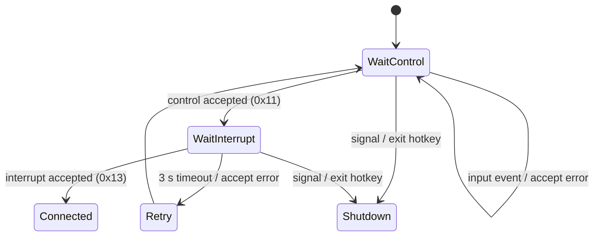
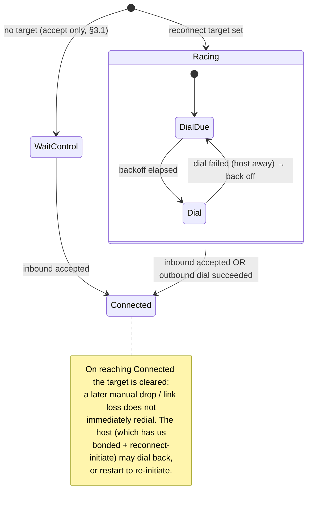
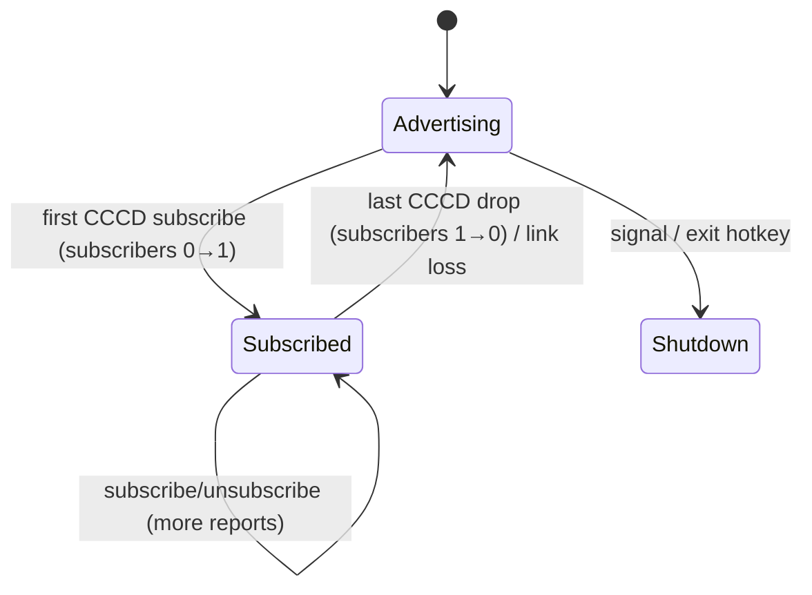
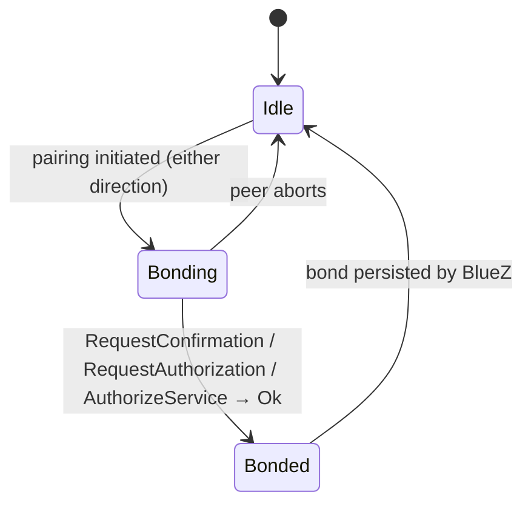

```mermaid
stateDiagram-v2
    [*] --> Waiting: discoverable; menu open (interactive)

    Waiting --> MenuNav: arrows / numbers / [o] Other / [r] Rescan
    MenuNav --> Waiting: rescan or submenu navigation
    Waiting --> MenuPick: user selects a host
    Waiting --> Incoming: a host connects to us
    Waiting --> Skipped: [q] / Enter / closed

    MenuPick --> Pairing: unbonded → restore TTY, pair from here (§5)
    Pairing --> Dialing: bonded
    Dialing --> Connected: HID PSMs dialed (§3.2)
    Dialing --> Incoming: host connects first (race)

    Incoming --> Connected: menu cancelled + joined (terminal restored)
    Skipped --> Waiting: keep accepting (+ any configured dial)
    Connected --> Waiting: session ended → menu re-opens
```

# Connection lifecycle & pairing

This document describes how blooter establishes, maintains and tears down a link
to a host, and where **pairing/agent handling** and **outgoing HID
(reconnect-initiate) connections** fit in. It complements the reference in
[design/ARCH.md](ARCH.md) (§4 transports, §9 lifecycle) and covers the two items
that were open in [TODO.md](../TODO.md).

Two guiding decisions shape everything below:

- **Config-first, inferred otherwise.** Behaviour is set in the config file
  where a setting makes sense; when a key is absent it is inferred from the
  runtime (chiefly: is stdin a TTY).
- **The menu is the starting point.** In interactive mode the host menu is the
  single entry point: the user picks a host, and blooter then does *whatever is
  needed to get a usable connection* — pair if necessary, then initiate the HID
  link.

## 1. The dimensions

Connection behaviour varies along three independent axes; the report pipeline
(design/ARCH.md §5, §7) is identical in every combination, so they all funnel
into one shared `Connected` state.

| Axis | Values | Chosen by |
|---|---|---|
| **Transport** | Classic (BR/EDR HID) · BLE (HOGP) | `[connection] protocol` |
| **Role** | Acceptor (host dials us) · Initiator (we dial a known host) | whether a reconnect target is set |
| **Mode** | Interactive (stdin is a TTY) · Non-interactive | `isatty`, `-n` |

Two config keys drive the new behaviour, each with an inferred default:

- **`[connection] pairing`** — `"auto"` (accept silently, Just Works) or
  `"confirm"` (prompt on the TTY). Absent → **inferred**: `confirm` when stdin is
  a TTY, else `auto`.
- **`[connection] reconnect`** — a host address (`"AA:BB:CC:DD:EE:FF"`) to
  initiate an outgoing HID connection to. Absent → no configured target; in
  interactive mode the menu supplies one at runtime.

## 2. Shared lifecycle (transport-agnostic)

`main::main_loop` is one state machine regardless of transport. `wait_connected`
establishes a link; `run_session` forwards reports until the link drops, a
hotkey fires, or a signal arrives.

```mermaid
stateDiagram-v2
    [*] --> Setup
    Setup --> Accepting: transport registered / bound

    state Accepting {
        [*] --> WaitLink
        WaitLink --> WaitLink: input event (track state, honour exit hotkey)
    }

    Accepting --> Connected: link established (Accept::Connected)
    Accepting --> Accepting: transient failure (Accept::Retry)

    state Connected {
        [*] --> Forwarding
        Forwarding --> Forwarding: input event → HID report
    }

    Connected --> Cooldown: host disconnect / drop-connection hotkey
    Cooldown --> Accepting: RECONNECT_DELAY (0.5 s)

    Accepting --> [*]: SIGTERM / SIGHUP / exit hotkey
    Connected --> [*]: SIGTERM / SIGHUP / exit hotkey
    note right of Connected
        SIGINT is ignored while Connected
        (the keystroke may be for the host).
    end note
```

Transitions map to existing types (`transport/mod.rs`): `Accept::Connected` →
`Connected`; `Accept::Retry` → re-enter `Accepting`; `Accept::Shutdown` →
terminate. `Flow::Continue` → `Cooldown`; `Flow::Shutdown` → terminate. On
entering `Connected`, blooter resets per-session state, drains stale input, takes
the `-x` grab, and calls `on_connected` (design/ARCH.md §6.3); on leaving it
releases the grab.

The Role axis refines only the **`Accepting`** box (§3.2); pairing (§5) is a
**parallel concern** that BlueZ can raise in any state.

## 3. Classic link establishment

### 3.1 Acceptor path

Classic waits for the host to dial the control PSM (0x11), then the interrupt PSM
(0x13) within 3 s (`transport/classic.rs`).



### 3.2 Initiator path — reconnect-initiate

The SDP record advertises `HIDReconnectInitiate = true` (design/ARCH.md §3.1);
this path makes it real. When a **reconnect target** is set (from the menu or
`[connection] reconnect`), `wait_connected` races an outbound HID dial against
the inbound accept, so blooter can bring the link up itself.



Outbound dial mechanics (mirrors the inbound pair in reverse):

1. `SeqPacket::connect(SocketAddr(target, BrEdr, 0x11))` — control.
2. `SeqPacket::connect(SocketAddr(target, BrEdr, 0x13))` — interrupt.
3. Hand both sockets to the unchanged `run_session`, exactly as an accepted pair.

Resolved design points:

- **Bonded targets only; never self-pair.** A target is used only if it is
  *already* bonded (checked when the target is resolved, §6). blooter never
  calls `Device::pair()` itself: an outgoing pair racing the host's incoming
  pair makes BlueZ cancel authentication (`ECONNREFUSED` on the HID PSMs of an
  unready host). Bonding a *new* host is therefore always driven by that host's
  incoming connection plus our agent (§5); reconnect-initiate only re-links a
  host blooter already knows.
- **Race, don't serialise.** `select!` the inbound `accept()` against the
  outbound dial; whichever completes first wins, the loser is cancelled.
- **Backoff.** A failed dial (host asleep/out of range) backs off exponentially
  (1 s → 30 s cap) while still accepting inbound, so it never busy-loops.
- **One-shot per link.** The target is cleared once a link is up (either
  direction), so intentional drops and link loss don't trigger an immediate
  redial. Reconnection after that is the host's job (it has us bonded and sees
  `HIDReconnectInitiate`), matching the acceptor default.
- **Classic only.** See §4.

## 4. BLE link establishment

BLE has no accept syscall: the host connects at the GATT layer and blooter is
"connected" once it subscribes to any Report characteristic's CCCD, disconnected
when the last subscription drops (`transport/le.rs`, design/ARCH.md §4.2).



Active **reconnect-initiate is Classic-only.** On BLE it is the controller's job:
BlueZ reconnects a bonded central when it reappears, and advertising invites a
known host back. blooter keeps relying on advertising + bond persistence. (A
future extension could page a known central; not needed now.)

## 5. Pairing / agent handling

A single shared BlueZ **agent** is registered in `main::run` for **both**
transports (previously only BLE had one; Classic had none, so an incoming pair
could stall). It is registered as the default agent, and the adapter is set
pairable. The agent's registered callbacks determine the negotiated IO
capability, which decides Just Works vs passkey. Its behaviour follows
`[connection] pairing` (§1).

### 5.1 `auto` (default when non-interactive)

Present `NoInputNoOutput` → **Just Works**; accept every request without a
prompt. This is exactly the previous LE agent, now shared with Classic.



### 5.2 `confirm` (default when interactive)

Prompt the user on the TTY before bonding, which also lets a keyboard-class host
show a **passkey to display**.

```mermaid
stateDiagram-v2
    [*] --> Idle
    Idle --> Prompt: pairing initiated

    state Prompt {
        [*] --> Ask
        Ask --> Approved: user accepts (Enter / y)
        Ask --> Declined: user declines
    }

    Prompt --> Bonded: Approved (confirm passkey / authorize)
    Prompt --> Idle: Declined (ReqError::Rejected)
    Bonded --> Idle
```

The `confirm` prompt reads from the same stdin as the menu, so the two must not
own the terminal at once. For a **user-initiated** pick this is naturally
ordered: the menu drops raw mode (restoring cooked mode) before it pairs. But an
**incoming** connection fires the agent's `request_confirmation` *while the menu
is still navigating in raw mode* — its crossterm `EventStream` would otherwise
read and discard the "y"/"n" reply (crossterm's reader thread consumes stdin as
it polls), so pairing never completes and the connection stalls. A small
`menu::TermCoord`, shared between the agent and each spawned menu, resolves this:
the prompt calls `TermCoord::borrow`, which suspends the running menu (drops it
out of raw mode **and drops its `EventStream`** so the reader thread stops) and
waits for the menu to acknowledge before printing (with a leading newline to
break away from the menu's last line). The returned guard resumes the menu — new
`EventStream`, full repaint — when the prompt is done. When no menu is running
(non-interactive, LE, or the menu already resolved) the borrow is a no-op.
Passkey *entry* (host shows digits, we type them) stays out of scope — as the
keyboard we only ever display / confirm.

## 6. Reconnect target & the concurrent menu

The Initiator path needs a target address. There are two sources — a configured
target and the interactive menu — and the menu runs **concurrently** with the
accept loop rather than as a blocking pre-step. The menu (`crate::menu`) is a
small `crossterm`-based TUI: arrow keys move, number keys pick a host, letter
keys drive actions (`[o]` Other devices, `[r]` Rescan, `[q]`/Enter skip).
Bluetooth audio/headsets and devices with no real name (only a hex identifier)
are moved to an **"Other devices"** submenu so the main list shows just plausible
HID hosts.

**Startup (Classic):** blooter makes the adapter discoverable (restoring the
prior state on exit) and prints that it is now visible, so a host can find and
connect to it. A configured `[connection] reconnect` address is kept as an
initial target **only if it is already bonded** (`initiate_target` in `main.rs`);
an unbonded or unset value leaves blooter accept-only.

**Per accept cycle (Classic `wait_connected`):** in interactive mode the menu is
(re)spawned as a task at the top of every `wait_connected` call, so it **re-opens
after a disconnect**. It feeds its pick to the transport over a channel; the menu
pick, the inbound accept, and any outbound dial all race in one `select!`. A
`oneshot` cancel signal (fired when the loop breaks on inbound-accept or
shutdown) preempts the menu; `wait_connected` then **joins** the menu task so its
terminal restore completes before the function returns.



- **Menu pick.** `menu::run` lists eligible hosts (plus the Other-devices
  submenu); selecting one drops raw mode, pairs it from here if it is new (a
  deliberate, single-initiator action, §5), and sends the address.
  `wait_connected` then dials that host (§3.2), still racing inbound.
- **Incoming preempts.** If a host connects while the menu is open, blooter fires
  the cancel signal, the menu restores the terminal and exits, and blooter uses
  the incoming connection — taken as the user's intent — logging a note.
- **Skip / non-interactive.** `[q]`/Enter (or no TTY) leaves blooter accepting,
  plus dialing any bonded configured target.
- **Pre-emptability.** The menu is fully async on the tokio runtime; every await
  (scan, key wait, pairing) sits under a `select!` arm that also polls the cancel
  signal, so an incoming connection or a signal preempts it cleanly and the
  terminal is always restored.

## 7. Fix connection (stale host SDP cache)

A host caches blooter's SDP record — the HID report descriptor included — for the
lifetime of its bond, and never re-reads it on a plain reconnect. BlueZ hosts keep
it in `/var/lib/bluetooth/<adapter>/cache/<blooter-addr>`. So **changing the
descriptor has no effect on an already-bonded host**: it keeps driving the layout
it cached when it first paired. The descriptor changes whenever the advertised
gamepad slot count does (ARCH.md §3.2), which under the default
`slots = "initial"` happens simply by plugging a controller in before startup.

The symptom is silent: the host connects, keyboard and mouse work, and the newly
advertised gamepad never appears — no error on either side.

### 7.1 Detection

`sdp::descriptor_fingerprint` hashes (FNV-1a) the descriptor blooter advertises.
`state::Hosts` persists `<address> <fingerprint>` per host, written whenever a
session is established, in `$XDG_STATE_HOME/blooter/hosts` (else
`$HOME/.local/state/blooter/hosts`, else `/var/lib/blooter/hosts`). A host whose
recorded fingerprint differs from the current one is **stale**: it is warned about
at startup and marked `stale` in the menu. A host with no record is *unknown*, not
stale — blooter never guesses.

All of this is best-effort: an unwritable state file costs a marker, never a
startup failure.

### 7.2 The fix

`[f]` in the menu, on any bonded host, runs `Classic::fix_host`:

1. Dial the host's control PSM and send HIDP `HID_CONTROL |
   VIRTUAL_CABLE_UNPLUG` (`0x15`). This is the profile's "forget this device"
   signal, legitimate because attribute `0x0204` (HIDVirtualCable) is `true`
   (ARCH.md §3.1). A BlueZ host responds by removing its bond, and its cached
   record is refreshed on the next pairing.
2. Remove **our own** bond to that host (`Adapter::remove_device`) and forget its
   fingerprint.

Step 2 is not optional. The host drops its bond on receiving the unplug; a bond
left in place on only one side breaks reconnection in *both* directions — an
inbound attempt cannot authenticate against our stale link key, and our outbound
dial is reset by a host that no longer knows us.

The user re-pairs from the host afterwards, which triggers a fresh SDP browse.

The same asymmetry applies in reverse: when a *host* unplugs us, `run_session`
drops our bond to match rather than leaving a one-sided bond behind.

An unreachable host cannot be sent an unplug at all; blooter says so and the bond
must be removed from that host's Bluetooth settings by hand.

### 7.3 What does not work

Ruled out by experiment before settling on the unplug:

- **Disconnect/reconnect** — a bonded host restores its UUIDs from storage and
  never re-browses.
- **Renaming the adapter** — propagates via EIR, but does not touch the cached
  records.
- **Bumping SDP attributes** (e.g. `0x0200` HIDDeviceReleaseNumber) — the host
  never re-reads the record, so it never sees the change.
- **Changing BD_ADDR** — would work, since the cache is keyed by address, but it
  needs re-pairing anyway, breaks every other host's bond at once, and requires
  mgmt `Set Public Address` or vendor HCI. Not implemented.

### 7.4 Avoiding it

A fixed `[gamepad] slots = N` keeps the descriptor stable across runs regardless
of what is plugged in, so the situation never arises. `slots = "initial"` (the
default) re-derives it from the controllers present at startup and can therefore
change it from run to run.

## 8. Scenario matrix

"Accept-only" = §3.1 / §4; "Initiate" = §3.2.

| Transport | Mode | Pairing (§5) | Link role |
|---|---|---|---|
| Classic | Interactive | `confirm` (inferred) | Accept + Initiate (menu pick) |
| Classic | Non-interactive | `auto` (inferred) | Accept + Initiate (`reconnect` if set) |
| Classic | Non-interactive, `-n` | `auto` | Accept-only (menu skipped) |
| BLE | Interactive | `confirm` (inferred) | Accept-only |
| BLE | Non-interactive | `auto` (inferred) | Accept-only |

Any inferred pairing default can be overridden by setting `[connection]
pairing` explicitly.

## 9. Implementation touch-points

- **`config.rs`** — add `[connection] pairing` (`auto`/`confirm`, optional →
  inferred) and `[connection] reconnect` (address string, optional).
- **`agent.rs`** (new) — the shared agent: `auto_accept_agent` (lifted out of
  `transport/le.rs`) and an interactive `confirm_agent`; registered in
  `main::run` for both protocols, keeping the handle alive for the process.
- **`transport/classic.rs`** — hold an optional bonded target and the adapter; `wait_connected` (re)spawns the menu each cycle and races
  inbound accept, outbound dial (connect both PSMs, no self-pairing) and the menu
  pick in one `select!`, with dial backoff; on break it cancels and joins the
  menu (restoring the terminal). The target is cleared on the first successful
  link, and an incoming connection preempts an open menu.
- **`transport/le.rs`** — drop its private agent; rely on the shared one.
- **`menu.rs`** — the interactive `crossterm` TUI: `run` scans, lists eligible
  hosts (audio/nameless devices under an "Other devices" submenu), navigates by
  arrow/number/letter keys with a rescan action, pairs a newly-picked (unbonded)
  host from here, and returns a `Pick` (address + whether `[f]` asked for a fix,
  §7). Marks stale hosts. Pre-emptable via a `oneshot` cancel; a pair attempt
  against a device bluetoothd has since dropped rediscovers and retries once.
- **`state.rs`** — the per-host descriptor-fingerprint file backing §7.1.
- **`setup.rs`** — adapter class/name/SSP preparation only (the menu moved out).
- **`main.rs`** — resolve pairing mode; register the agent; power/pairable the
  adapter and make it discoverable (restored on exit); resolve a bonded
  configured target; pass the adapter into the Classic transport for the menu.
</content>
